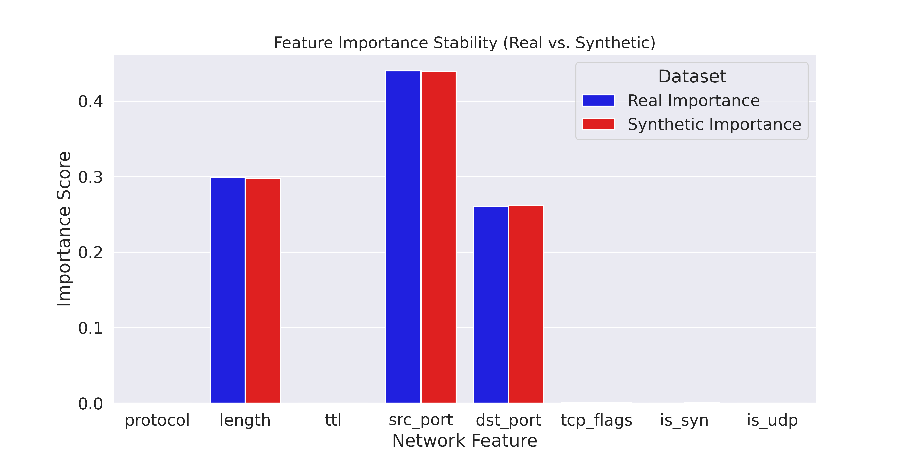
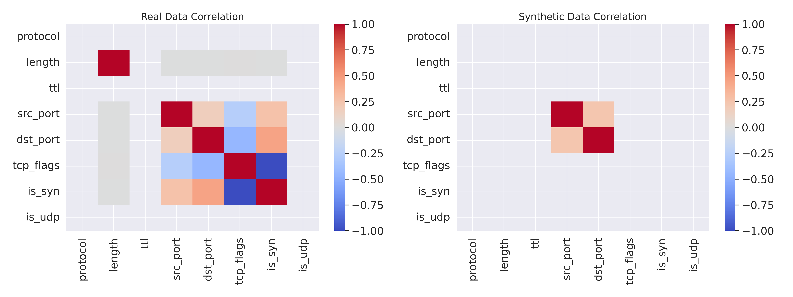

# Privacy-Preserving NIDS Data Generation using Robust GANs

**NIDS-Gans** is a research framework designed to address data scarcity and privacy challenges in Network Intrusion Detection Systems (NIDS). This project combines high-fidelity network simulation using **OMNeT++** with **Robust Generative Adversarial Networks (GANs)** to synthesize realistic, privacy-preserved cybersecurity datasets.

## 📂 Repository Structure

```text
NIDS-Gans/
├── Omnet_Files/
│   ├── PacketGen.ned       # Network Topology (Server, Attacker, Clients)
│   ├── http_traffic.ini    # Simulation config for HTTP traffic & attacks
│   ├── ssh_traffic.ini     # Simulation config for SSH traffic & attacks
│   └── omnetpp.ini         # Base configuration
├── Pcaps/
│   ├── nids_attacker_dataset.pcap      # Raw malicious traffic logs
│   ├── nids_server_dataset.pcap        # Raw server-side traffic logs
│   ├── nids_attacker_dataset_ssh.pcap  # SSH specific attack logs
│   └── nids_server_dataset_ssh.pcap    # SSH specific server logs
└── Results/                            # Analysis figures and GAN models
```

## 🛠️ Part 1: Network Simulation (OMNeT++)

We utilized the **INET Framework** within OMNeT++ to simulate a realistic network environment under controlled Cyber Attacks.

### Topology (`FiveNodeNetwork`)
The network consists of a **Star Topology** with a central Ethernet Switch connecting:
* **Victim Server**: Hosts HTTP (Port 80) and SSH (Port 22) services.
* **Attacker Node (10.0.0.5)**: A dedicated node executing scripted attacks.
* **Legitimate Clients**: Nodes generating background noise (randomized requests/replies) to mimic real-world traffic.

### Attack Scenarios
The simulation covers three primary attack vectors defined in the `.ini` files:

| Attack Type | Protocol | Start Time | Characteristics |
| :--- | :--- | :--- | :--- |
| **SYN Flood** | TCP | `10s` | High-frequency SYN requests (1000 req/session, 64B) to exhaust resources. |
| **Port Scan** | TCP | `30s` | Sequential scanning of ports 20-1000 or targeted SSH port scanning. |
| **UDP Flood** | UDP | `60s` | High-volume UDP packets (1200B) targeting Port 5000 at 1ms intervals. |

## 🧠 Part 2: Methodology (The "Robust GAN")

### 1. Data Engineering
* **Source**: Raw `.pcap` files were parsed using `scapy` to extract packet headers and payloads.
* **Identification**: Through "Top Talker" analysis, we identified the attacker IP (`10.0.0.5`) responsible for >100k packets.
* **Balancing**: Unlike traditional preprocessing that removes duplicates, we **retained duplicate rows** to preserve the volumetric characteristics essential for Flood attacks.
    * **Benign Traffic**: ~101,522 packets
    * **Malicious Traffic**: ~101,022 packets

### 2. The Robust GAN Architecture
Standard GANs initially failed the "Privacy Test" (achieving only 51% detection accuracy due to Mode Collapse). To solve this, we developed a **Robust GAN** architecture incorporating:
* **Batch Normalization**: Stabilized the Generator's learning process.
* **Dropout (0.3)**: Prevented the Discriminator from memorizing training data.
* **Label Smoothing**: Softened labels (0.9 instead of 1.0) to reduce overconfidence.
* **Optimization**: utilized a large batch size (1024) to ensure stable convergence during training.

---

## 📊 Part 3: Experiments & Results

We conducted two major experiments to validate the quality of the synthetic data.

### Experiment A: The Augmentation Test
*Goal: Does adding synthetic data hurt standard detection?*
* **Baseline (Real Data Only)**: 99.90% Accuracy.
* **Augmented (Real + GAN Data)**: 99.90% Accuracy.
* **Conclusion**: The synthetic data is high-quality and "safe" to use, mirroring real traffic perfectly without introducing noise.

### Experiment B: The Privacy Test (The Hard Problem)
*Goal: Can we train a detector **purely on synthetic data** and successfully catch **real-world attacks**?*
## 4. Visual Validation

To ensure the synthetic data is not just "random noise" but actually statistically valid, we performed two advanced validation tests.

### A. Feature Importance Stability
We trained two separate Random Forest classifiers: one on **Real Data** and one on **Synthetic Data**. We then extracted the "Feature Importance" scores to see which network attributes the models relied on to detect attacks.




**Observation:** The feature importance distribution is nearly identical. Both models identified `src_port` and `length` as the most critical indicators of an attack.
**Conclusion:** The GAN successfully captured the *predictive logic* of the attacks. A model trained on our synthetic data learns the same decision boundaries as a model trained on real data.

### B. Correlation Analysis
We compared the Pearson correlation matrices of the original and generated datasets to verify if inter-feature relationships (e.g., *Does Source Port correlate with Destination Port?*) were preserved.




**Observation:**
1.  **Port Correlation Preserved:** The central "hotspot" (Red block) showing the relationship between `src_port` and `dst_port` is clearly visible in the synthetic data.
2.  **Noise Reduction:** The synthetic matrix is sparser (more grey areas). This indicates that the GAN acted as a noise filter, standardizing features like `packet_length` and `ttl` to their dominant values (e.g., fixing packet length to 64 bytes for SYN floods) while maintaining the complex variance in port behavior.

| Metric | Score | Note |
| :--- | :--- | :--- |
| **Accuracy** | **89.99%** | Massive improvement over the initial 51% baseline. |
| **Precision** | **1.00** | **Zero False Positives.** |
| **Recall** | **0.80** | Successfully detected 80% of real attacks. |

## 🚀 Usage

### Prerequisites
To replicate this work, you will need the following tools:
* **[OMNeT++](https://omnetpp.org/download/)** (Version 6.0 or higher recommended)
* **[INET Framework](https://inet.omnetpp.org/)** (Version 4.x)
* **Python 3.8+**
  * Required libraries: `scapy`, `pandas`, `numpy`, `tensorflow`/`pytorch`, `scikit-learn`, `matplotlib`.

### 1. Running the Network Simulation
1.  Clone this repository:
    ```bash
    git clone [https://github.com/Sazidul0/NIDS-Gans.git](https://github.com/Sazidul0/NIDS-Gans.git)
    ```
2.  Open the OMNeT++ IDE and import the project:
    * **File** > **Import** > **General** > **Existing Projects into Workspace** > Select the `Omnet_Files` directory.
3.  Run a simulation scenario:
    * Navigate to `Omnet_Files/`.
    * Right-click `http_traffic.ini` or `ssh_traffic.ini`.
    * Select **Run As** > **OMNeT++ Simulation**.
4.  The simulation will generate `.pcap` files in the configured output directory (default is `results/` or `Pcaps/`).

### 2. Training the GAN
1.  Navigate to the directory containing your Python scripts (e.g., root or a `Scripts/` folder).
2.  Run the training script pointing to your generated PCAP data:
    ```bash
    python train_gan.py --input Pcaps/nids_attacker_dataset.pcap --epochs 500 --batch_size 1024
    ```
    *(Note: Ensure your `train_gan.py` script is set up to handle the parsing and preprocessing as described in the Methodology.)*

---

## 🤝 Contributing

Contributions are welcome, especially for expanding the attack scenarios or improving the GAN architecture.

1.  Fork the repository.
2.  Create your feature branch (`git checkout -b feature/NewAttackVector`).
3.  Commit your changes (`git commit -m 'Add DDoS implementation'`).
4.  Push to the branch (`git push origin feature/NewAttackVector`).
5.  Open a Pull Request.
